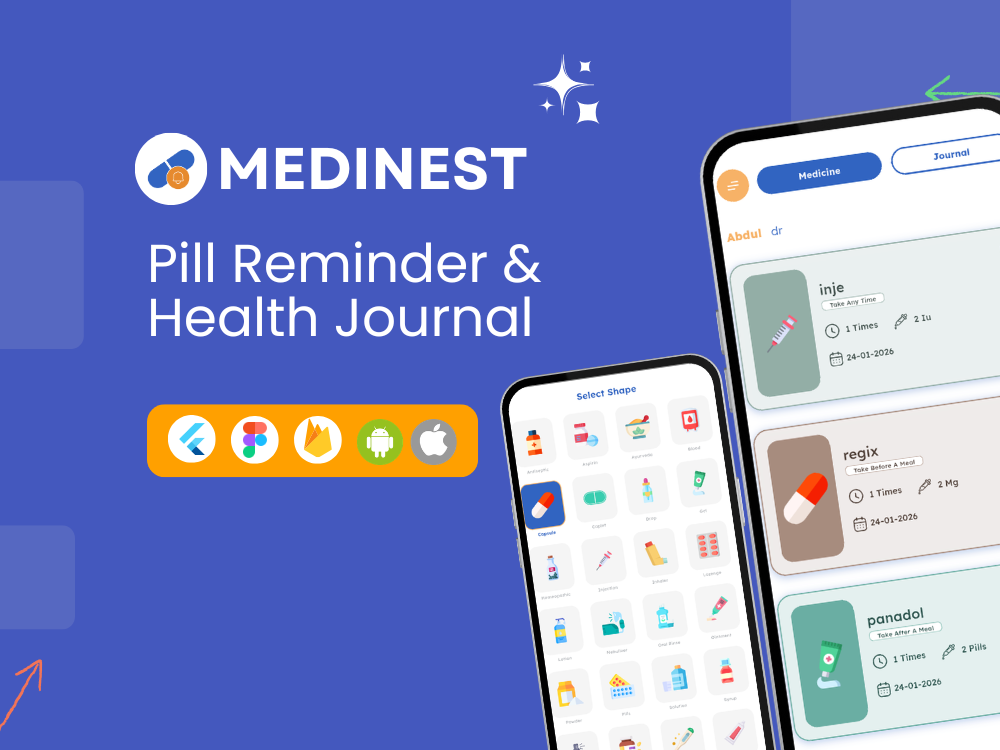
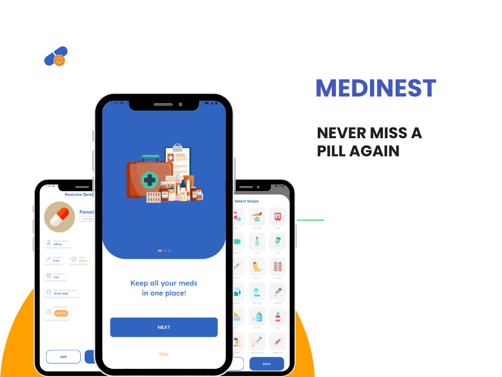
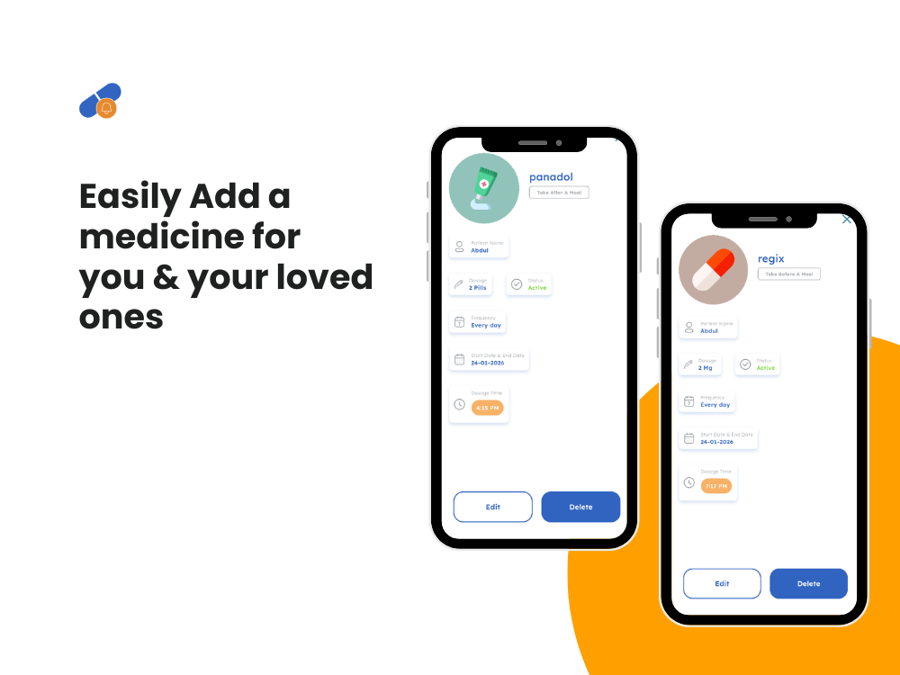
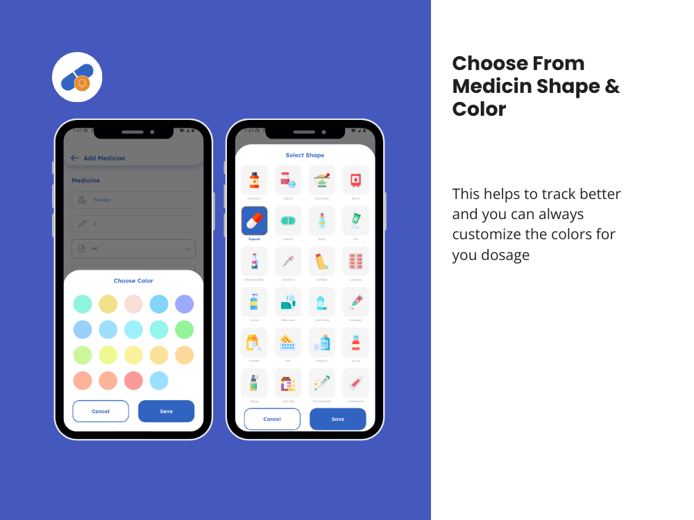
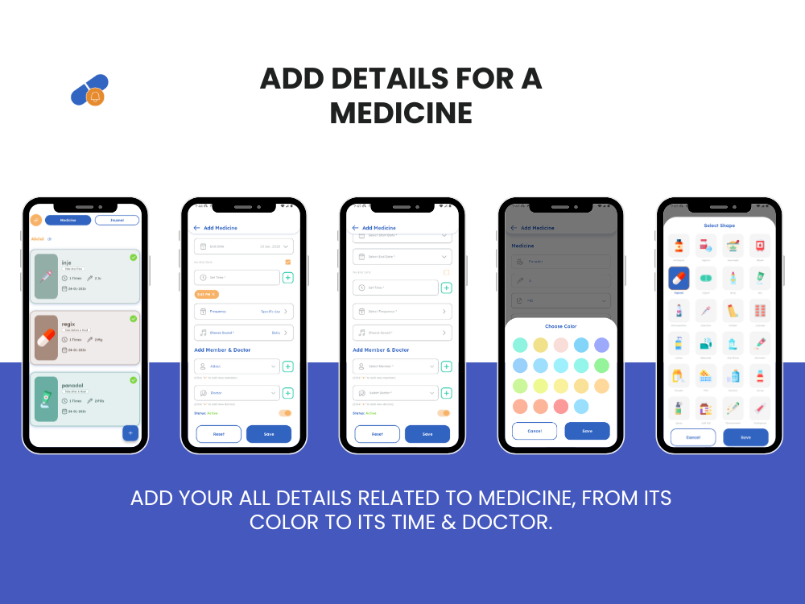
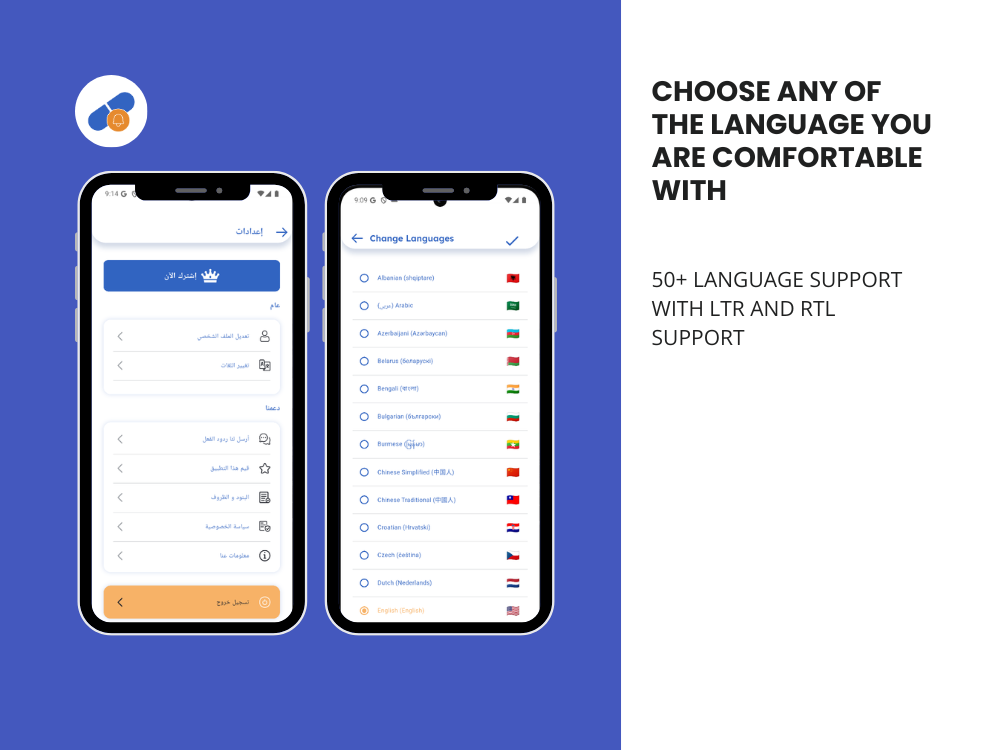
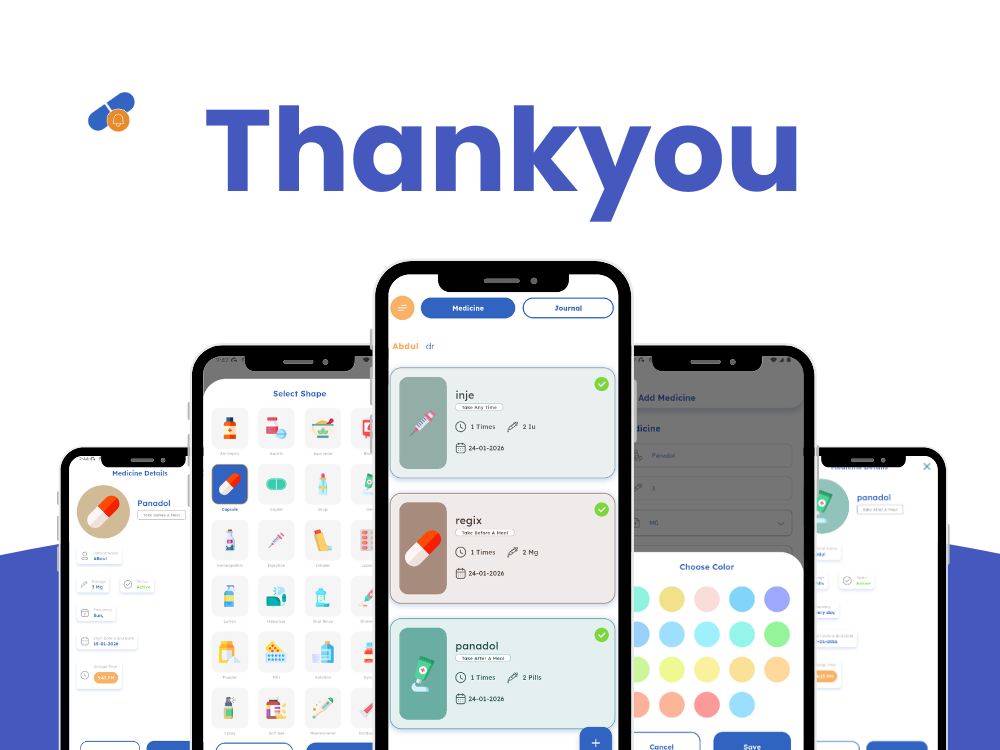

# Medinest

Medinest is a Flutter-based medication reminder and personal journaling app, designed to help users
reliably manage pills, record notes, and coordinate care with doctors and family members. It offers
strong offline support with cloud synchronization to ensure data is always accessible and secure.

Built with Flutter 3, GetX, Firebase, and Sqflite, Medinest is designed for scalability,
performance, and maintainability.

## Core Features

- **Medication Management**: Create pill reminders with precise schedules and custom alert sounds.
  Reminders can be associated with the user, a doctor, or a family member for shared care scenarios.
- **Personal Journaling**: Log notes related to medication intake, symptoms, or general daily health
  observations.
- **Doctor & Family Profiles**: Organize reminders and records for multiple dependents or caregivers
  in a structured way.
- **Offline-first & Cloud Sync**: Core functionality works offline via Sqflite, with Firebase
  handling authentication, cloud sync, notifications, and backups.
- **Monetization**: AdMob and in-app subscriptions integrated using official Flutter APIs.

## Tech Stack

- **Flutter (Dart)** – Cross-platform UI and application logic
- **GetX** – State management, routing, and dependency injection
- **Firebase** – Auth, Firestore, Storage, Cloud Messaging, App Check
- **Sqflite** – Local persistent storage for offline access
- **Flutter Local Notifications** – Time-critical medication alerts
- **Google Mobile Ads** – AdMob integration
- **In-App Purchases** – Subscription handling
- **Dio** – Networking
- **Timezone & Flutter Timezone** – Accurate scheduled notifications

## Architecture Overview

Medinest follows a modular, feature-oriented structure with clear separation between UI,
controllers, services, and data layers.

- **GetX** is used consistently for state management and navigation to reduce boilerplate and
  improve testability.
- **Local data** acts as the source of truth, while Firebase serves as a synchronization and backup
  layer without being required for core functionality.

## Screenshots

